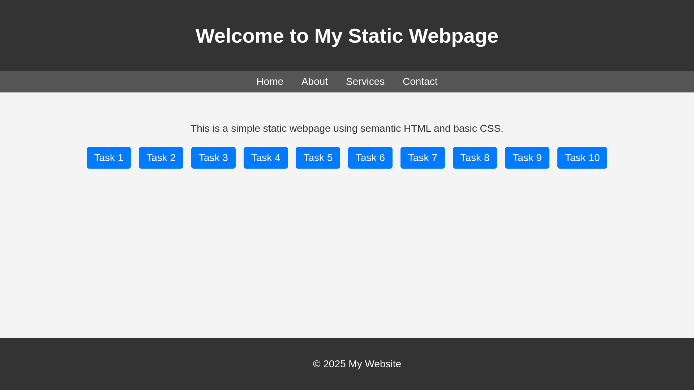

## Objective
Create a single-page website using semantic HTML elements such as `<header>`, `<nav>`, `<main>`, and `<footer>`.

## Requirements
- Apply basic CSS styling for typography and colors.
- Use CSS for spacing (margins and paddings) to create a clear structure.
- Implement a simple responsive design that adjusts the layout on smaller screens using media queries.

## Implementation Details

### HTML Structure
- The `<header>` element contains the title of the webpage.
- The `<nav>` element includes links to different sections of the page.
- The `<main>` section contains the main content.
- The `<footer>` includes copyright information.
- A new section with ten buttons linking to different task pages (Task 1 to Task 10) has been added.

### CSS Styling
- Basic styling applied for colors, font, and spacing.
- Navigation links styled with white text on a dark background.
- Responsive design ensures proper spacing on smaller screens.
- Buttons for tasks are styled with a blue background and rounded corners.

### Responsive Design
- Used media queries to adjust padding for smaller screens (max-width: 600px).
- Buttons are displayed in a structured layout that adapts to different screen sizes.

