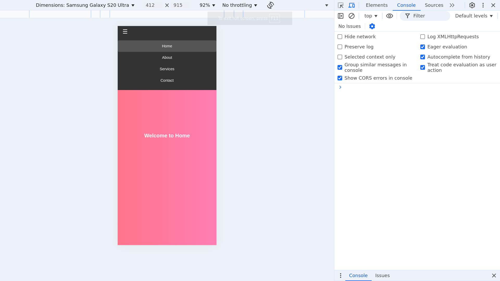

## Objective

 Create a fully functional, multi-section website that simulates the experience of navigating between different pages—all without any JavaScript.
## Requirements
- Use the `:target` pseudo-class to display and hide different “pages” or sections of content.
- Incorporate CSS animations and transitions to simulate page transitions (such as fading or sliding effects).
- Design an accessible navigation menu that works across different devices and screen sizes.
- Ensure that the entire experience is responsive and leverages advanced CSS techniques (e.g., combining Flexbox, Grid, and pseudo-classes) to manage layout and state transitions.
## Working

The navigation menu links (&lt;a href="#home">, etc.) use anchor links to target different sections.

The :target pseudo-class makes only the selected section visible while hiding others.

CSS animations (fade-in, scale-in) enhance the transition effects.

The navigation bar remains fixed at the top for better usability.

A JavaScript function toggles the navigation menu on small screens to ensure accessibility.
## Output

