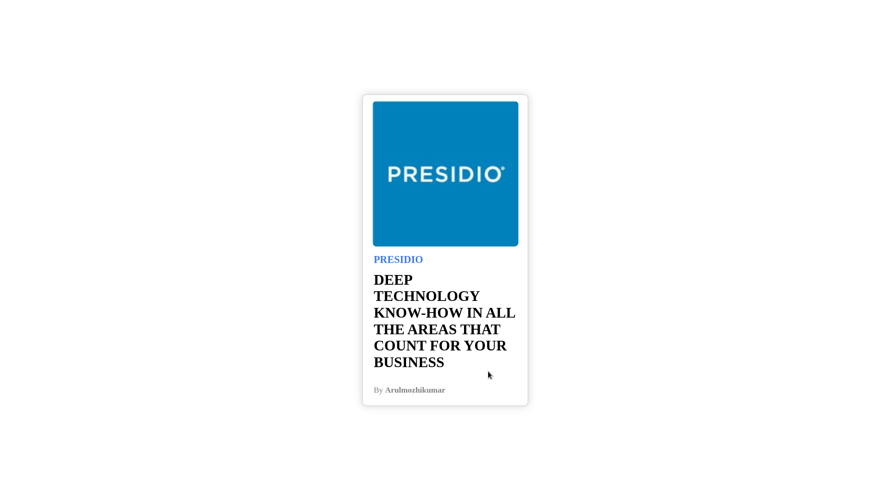

# Objective 
**Build a card that includes an image, a title, and a description.**

# CSS Card Component - Properties Used & Their Functions

## 1. **Layout and Positioning**
- `display: flex;` → Enables Flexbox for easy alignment of elements.
- `justify-content: center;` → Centers elements horizontally.
- `align-items: center;` → Centers elements vertically.
- `height: 100vh;` → Makes the container take up the full viewport height.
- `margin: 0 auto;` → Centers the element horizontally.

## 2. **Box Model (Spacing, Borders, Padding)**
- `padding: 0.4em;` → Adds space inside the card for a better layout.
- `border: 1px solid #ccc;` → Defines a light gray border around the card.
- `border-radius: 6px;` → Rounds the corners for a softer look.

## 3. **Background and Colors**
- `background-color: white;` → Sets the background color for the page.
- `background: #fff;` → Sets the card background to white.
- `color: black;` → Defines text color.
- `text-transform: uppercase;` → Converts text to uppercase for styling.

## 4. **Typography**
- `font-size: 0.7em;` → Adjusts the text size relative to the parent.
- `font-weight: 600;` → Makes the text bold for emphasis.

## 5. **Hover Effects and Transitions**
- `transition: transform 0.3s ease, box-shadow 0.3s ease;`  
  → Ensures smooth animations when hovering over the card.
- `transform: scale(1.05);` → Slightly increases the size of the card on hover.
- `box-shadow: 0 0 11px rgba(33,33,33,.2);` → Adds a shadow effect for depth.

## 6. **Image Styling**
- `width: 200px; height: 200px;` → Sets the size of the image container.
- `border-radius: 6px;` → Gives rounded corners to the image.
- `background-color: rgb(236, 236, 236);` → Sets a placeholder background color.

## Output

**Before Hover**

**After Hover**

