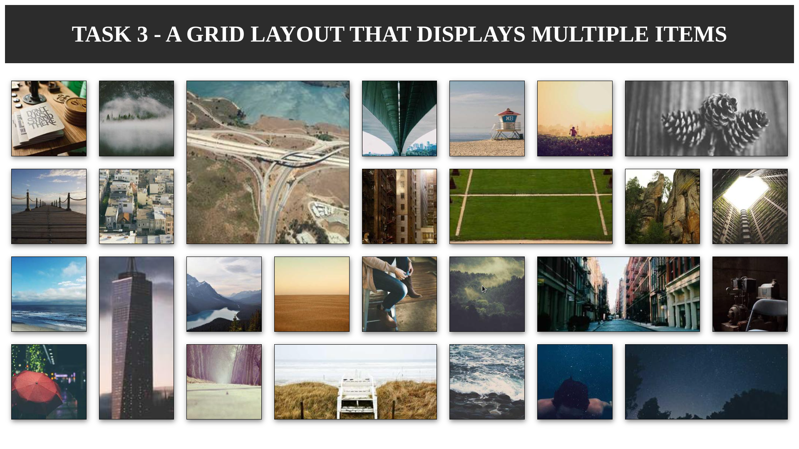
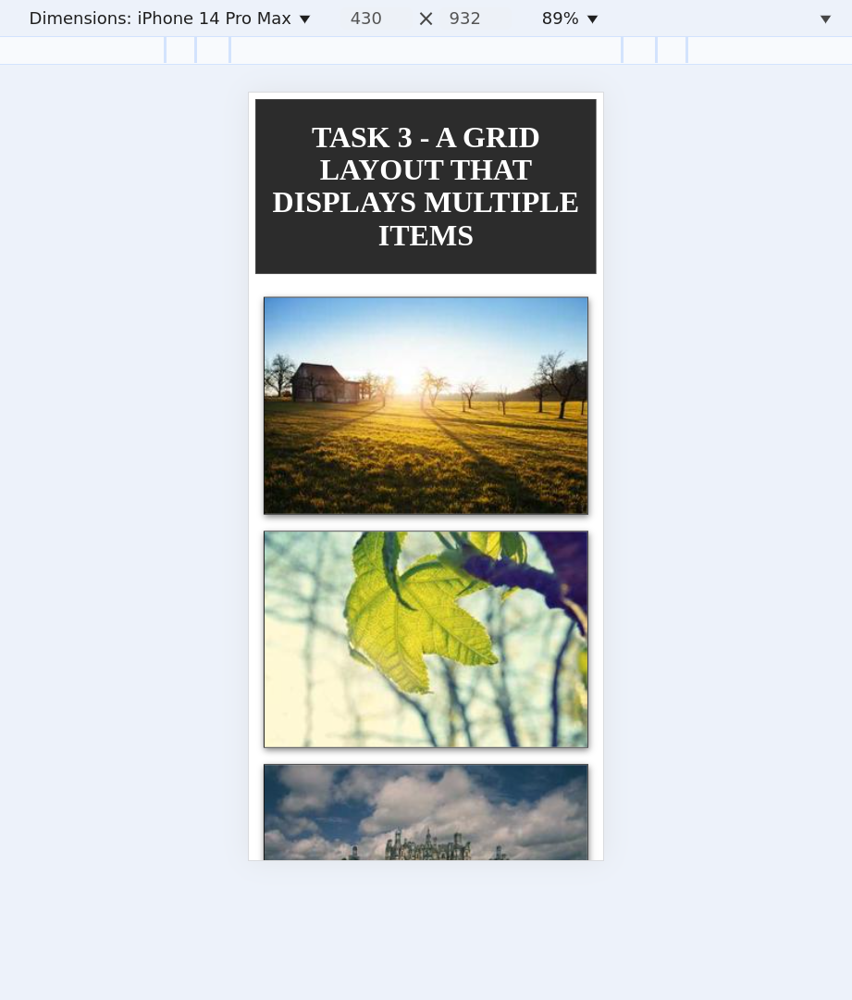
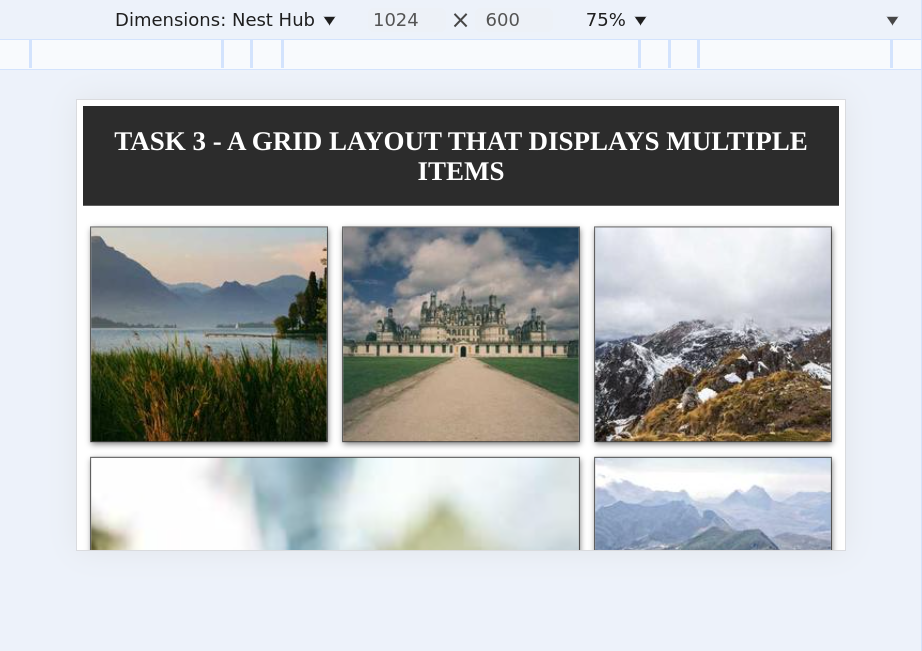

# Objective: 
**Create a grid layout that displays multiple items.**

## How the Grid Works
1. **Default Layout** → 2 columns  
2. **Mobile (≤ 500px)** → 1 column (single image per row)  
3. **Tablet (≥ 600px)** → 2 columns  
4. **Larger Screens (≥ 900px)** → 3+ columns, increasing dynamically  
5. **Highlighted Items**  
   - `.highlight-box` → Spans **2 rows & 2 columns**  
   - `.highlight-tall` → Spans **2 rows**  
   - `.highlight-wide` → Spans **2 columns**

### Grid Structure:
- Uses `grid-template-columns` to define different column layouts for different screen sizes.
- Uses `grid-auto-rows` to maintain a proportional height for each grid item.

### Media Queries:
- Adjusts the number of columns dynamically based on screen width.
- Ensures a **single-column layout** on small screens and **multiple columns** on larger screens.

## Image Handling
- Uses **random images** from `https://picsum.photos/`
- Images are set to **100% width & height**
- Maintains aspect ratio with `object-fit: cover`

# Output

**Larger Screen**

**Smaller Screen**

**Medium Screen**
