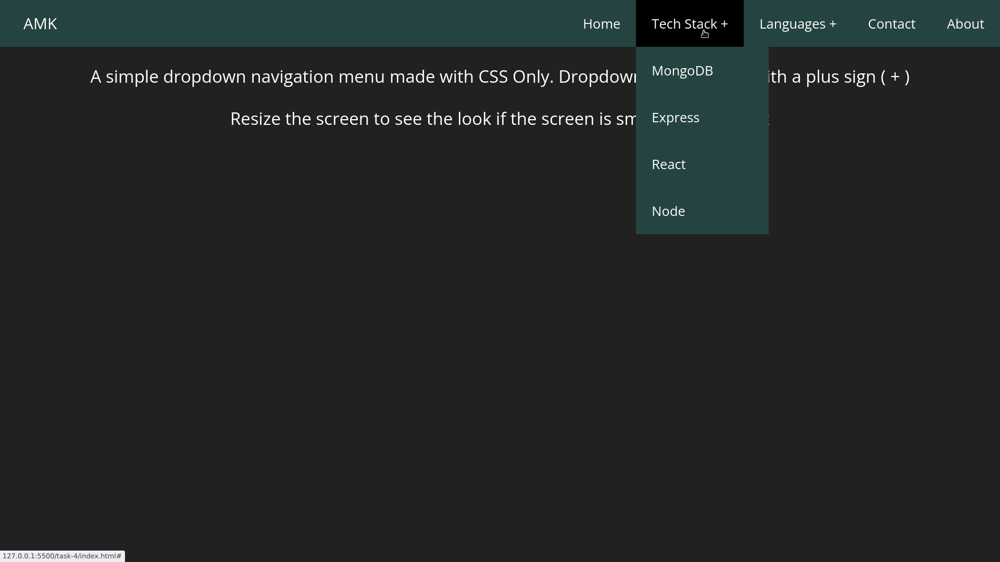
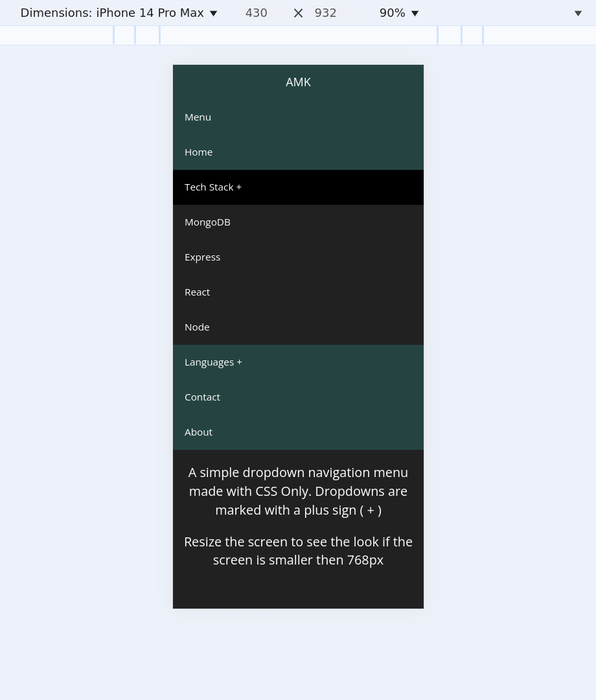

# Objective: 
Design a navigation bar with a dropdown submenu that appears on hover. (Pure CSS Dropdown Menu)

### HTML (index.html)
The navigation menu is built using **semantic HTML** and structured as follows:
- **`<nav>`**: Wrapper for the navigation menu  
- **`<ul class="menu">`**: Main menu container  
- **`<li>` elements**: Each menu item (some with dropdowns)  
- **Checkbox Inputs (`<input type="checkbox">`)**:
  - Used to **toggle dropdowns** in mobile view  
  - Paired with **labels (`<label>`)** for user-friendly interaction  
- **Dropdown Structure**:
  - First-level menu has a label with `+` sign to indicate expandability  
  - Submenus are **nested `<ul>` lists inside `<li>`**  

---

### CSS (styles.css)
#### Basic Styling
- `body`: Dark theme with **white text**
- `nav`: Background color **(#254441)**  
- `#logo`: Display site name  
- `nav a`: White text, padding for spacing, hover effects  

#### Dropdown Logic (Desktop)
- `nav ul ul { display: none; }` → Hides dropdowns by default  
- `nav ul li:hover > ul { display: inherit; }` → Shows dropdowns on hover  

#### Responsive Design (Mobile)
- `@media (max-width: 768px) {}` handles the mobile layout  
- `display: none;` hides the **menu by default**  
- Checkboxes (`[id^=drop]:checked + ul {}`) **toggle the dropdowns**  

---

#### OUTPUT
# Laptop Screen

# Mobile Screen
