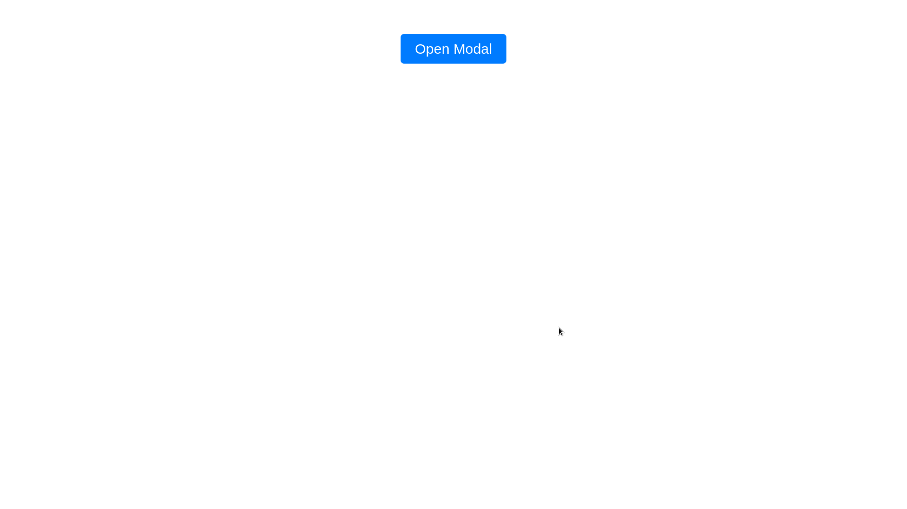
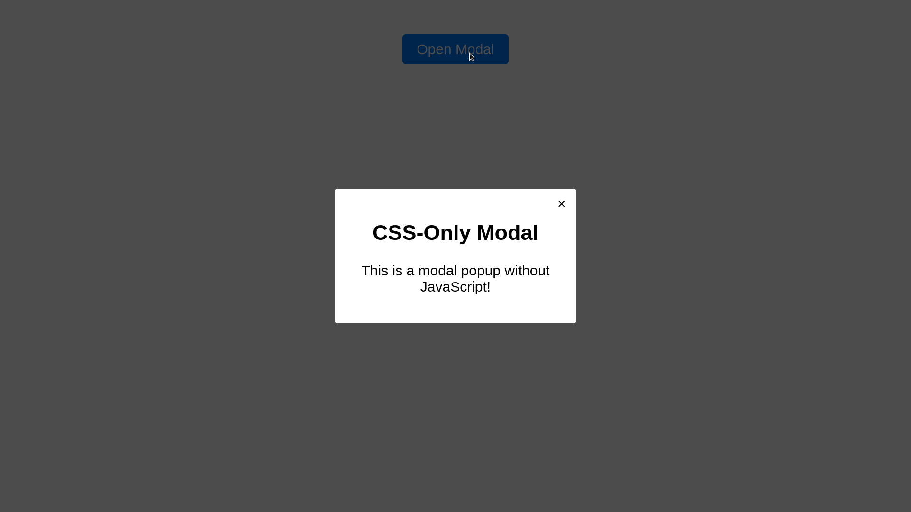

# **Objective**  
Create a **modal popup using only CSS** with the `:target` pseudo-class. This modal will open when the user clicks a button and close when they click the close button.

## **Features**  
- **No JavaScript Required**: Uses only HTML & CSS.  
- **Opens on Click**: Triggered using an anchor (`href="#modal"`).  
- **Closes on Click**: Clicking the close button (`href="#"`) removes the target. 

## **CSS Properties Used**  
### **Modal Visibility**  
- `display: none;` → Hides modal by default  
- `:target` → Shows modal when targeted with an anchor link  

### **Modal Positioning**  
- `position: fixed;` → Ensures modal stays in place  
- `top: 50%; left: 50%; transform: translate(-50%, -50%);` → Centers the modal  

### **Backdrop Effect**  
- `background: rgba(0, 0, 0, 0.7);` → Creates a semi-transparent background  

### **Close Button**  
- `position: absolute; top: 10px; right: 15px;` → Places close button at the top-right  
- `font-size: 24px; cursor: pointer;` → Makes it clickable  

### **Transitions & Animations**  
- `opacity: 0; transition: opacity 0.3s ease-in-out;` → Smooth fade-in effect  
- `#modal:target { opacity: 1; }` → Makes the modal visible  

## **Responsive Design**  
- `max-width: 400px;` → Limits modal width on small screens  
- `width: 90%;` → Ensures the modal scales well  
- `text-align: center;` → Centers content  

## **How It Works**  
1. Clicking the **open modal button** (`href="#modal"`) adds `#modal` to the URL.  
2. The `:target` selector activates, displaying the modal.  
3. Clicking the **close button** (`href="#"`) removes the target, hiding the modal.  

## **Output**  
  

 

