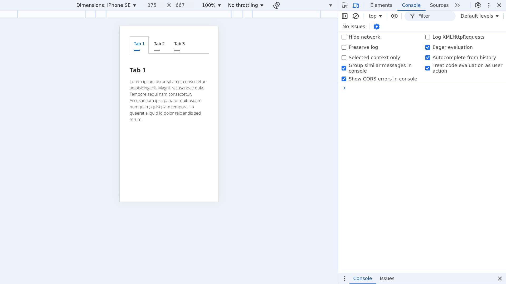

## Objective
Create a Tabbed Content Interface using only CSS, utilizing radio buttons and labels to switch between tabs.

## Features
✅ No JavaScript Required - Uses only HTML & CSS.
✅ Tabs Using Radio Buttons - Hidden radio buttons control tab selection.
✅ Smooth Transitions - Uses the :checked pseudo-class for smooth visibility toggling.

## CSS Properties Used
Tab Selection & Display
display: none; → Hides radio buttons

:checked → Shows the selected tab content

Tab Navigation Styling
cursor: pointer; → Makes tabs clickable

font-weight: 600; → Highlights active tab

border-bottom: none; → Active tab connects to content

Content Styling
display: none; → Initially hides tab content

padding: 20px; → Ensures spacing inside tabs

border-top: 1px solid #ccc; → Creates separation between tabs and content

## How It Works
Clicking a tab label checks the corresponding radio button.

The :checked selector activates, displaying the associated content while hiding others.

The active tab gets highlighted.

## Responsive Design
max-width: 600px; → Ensures content is readable on small screens

width: 90%; → Scales dynamically to fit different screen sizes

text-align: center; → Aligns tab content properly

## Output
