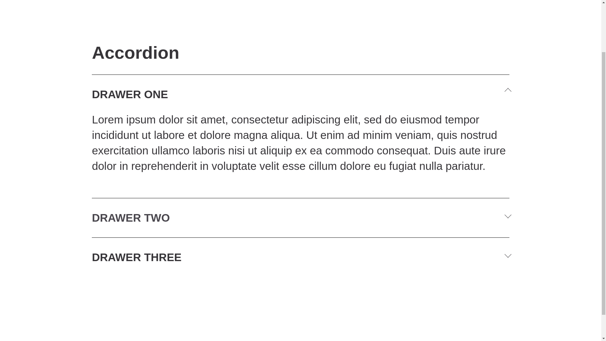

## **Objective**
Build an **accordion component** using **pure CSS** that allows content sections to expand and collapse on click.

---

## **Requirements**
1. **Checkbox Hack Approach:**  
   - Use hidden `<input type="checkbox">` elements to control the state of each section.
   - Clicking the label toggles the checkbox, expanding or collapsing the section.
   
2. **CSS Transitions for Smooth Animation:**  
   - Apply `max-height` and `overflow: hidden` to create a **sliding effect**.
   - Use `transition: 0.25s ease-in-out;` to animate the expansion and collapse.

3. **Expandable Sections:**  
   - **Allow multiple sections to be open at the same time** (default behavior).
   - Optionally, modify the approach to allow **only one section open at a time**.

4. **Responsive Design:**  
   - Adjust padding for **smaller screens** to maintain a clean UI.

---

## **CSS Functionalities**
| **Feature**            | **Description** |
|------------------------|---------------|
| **Expandable Sections** | Clicking a title expands its content |
| **Smooth Transitions**  | Uses `max-height` + `overflow` for smooth animation |
| **Arrow Rotation**      | The arrow icon rotates when expanded |
| **Hover Effects**       | Title color changes on hover |
| **Mobile Friendly**     | Padding and layout adjust on smaller screens |

---

## **How It Works**
1. Each section contains:
   - A **hidden checkbox (`input[type=checkbox]`)**.
   - A **label (`.faq-drawer__title`)** that acts as a button.
   - A **content wrapper (`.faq-drawer__content-wrapper`)**.

2. When the **label is clicked**:
   - The associated checkbox gets **checked**.
   - The content expands by changing `max-height` from `0px` to `350px`.

3. When **unchecked**:
   - The section collapses smoothly.

---

## **Working Mechanism**
| **Action** | **CSS Rule Applied** |
|-----------|----------------------|
| **Click on a title** | `:checked + label + .faq-drawer__content-wrapper { max-height: 350px; }` |
| **Checkbox checked** | Arrow rotates using `transform: rotate(-45deg);` |
| **Checkbox unchecked** | Content collapses back to `max-height: 0px;` |

---

##  **Output**

