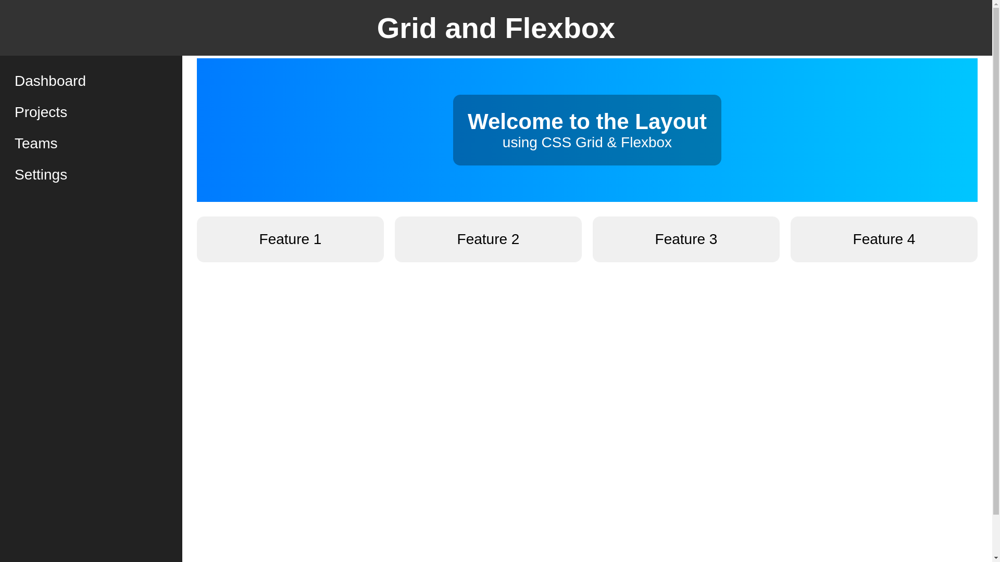
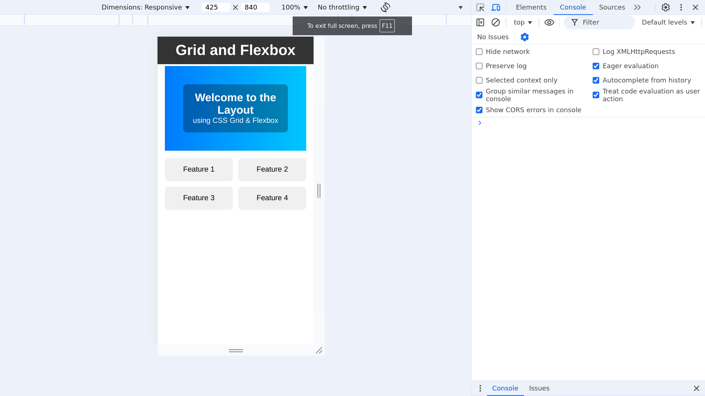

## **Objective:**  
Create a **fully responsive webpage layout** using a combination of **CSS Grid** and **Flexbox**, ensuring a clean, structured, and adaptive design.

---

## **Functionalities & Requirements**  

### 1. **CSS Grid for Page Layout:**  
   - Use **CSS Grid** to define the overall page structure.  
   - Grid should have **two columns on large screens** (sidebar + main content).  
   - On small screens, the sidebar should be **removed**, keeping only the main content.  

### 2. **Flexbox for Inner Alignment:**  
   - Inside the **main content**, use **Flexbox** to align and space elements.  
   - The **header** should be a flex container for proper alignment.  
   - Content cards should **wrap** and adjust spacing dynamically.  

### 3. **Sticky Header:**  
   - The **header should remain fixed** at the top on scroll.  
   - It should be fully **responsive and mobile-friendly**.  

### 4. **Overlapping Elements:**  
   - Some elements (e.g., images, badges, or floating UI components) should **overlap** using `position: absolute` and `z-index`.  

### 5. **Responsive Adjustments:**  
   - On **large screens**: Sidebar should be visible.  
   - On **small screens**: Sidebar should be **hidden**, keeping a single-column layout.  
   - Cards should **stack** vertically on smaller viewports.  

---

## **Working Mechanism**
| **Feature**              | **Description** |
|--------------------------|----------------|
| **Sticky Header**        | The header remains fixed on scroll. |
| **Sidebar Hidden on Mobile** | Sidebar is removed when the viewport is small. |
| **Grid-Based Layout**    | Main sections arranged using CSS Grid. |
| **Flexbox for Cards**    | Cards are spaced and aligned dynamically. |
| **Overlapping Elements** | Some elements overlap using absolute positioning. |
| **Fully Responsive**     | Adjusts layout for different screen sizes. |

---
## Output

